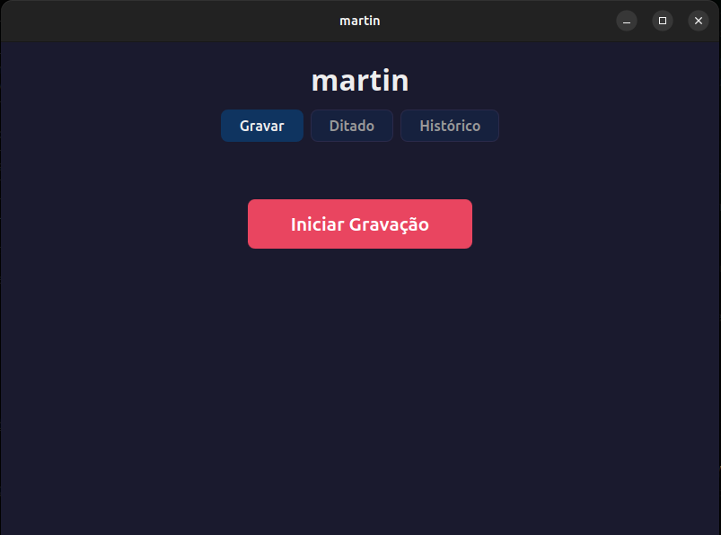
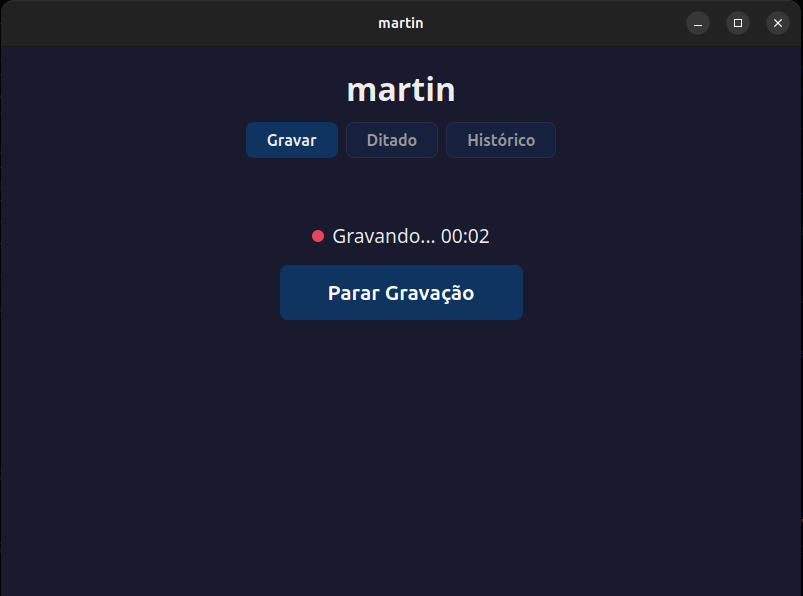
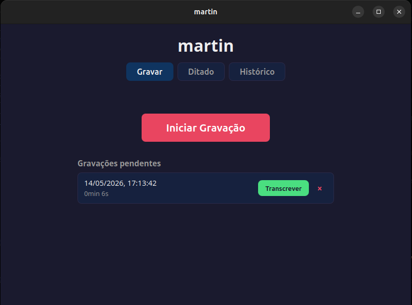
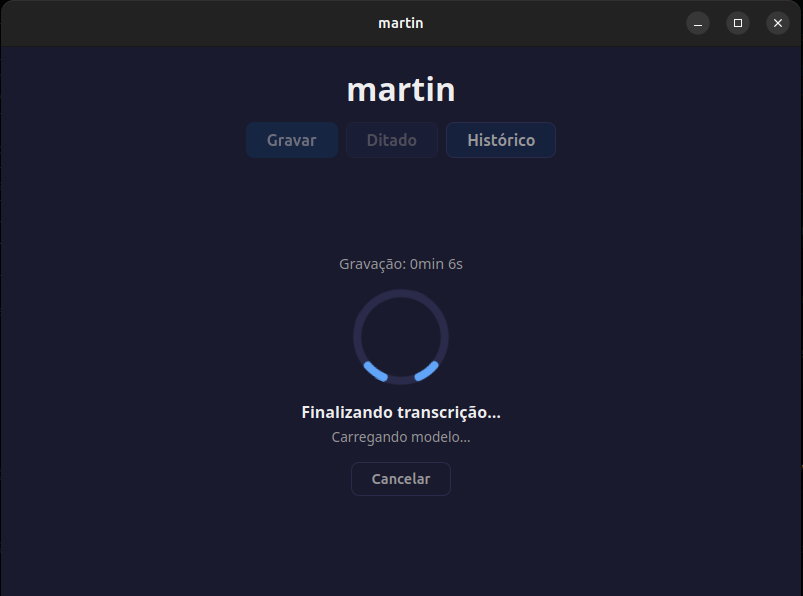
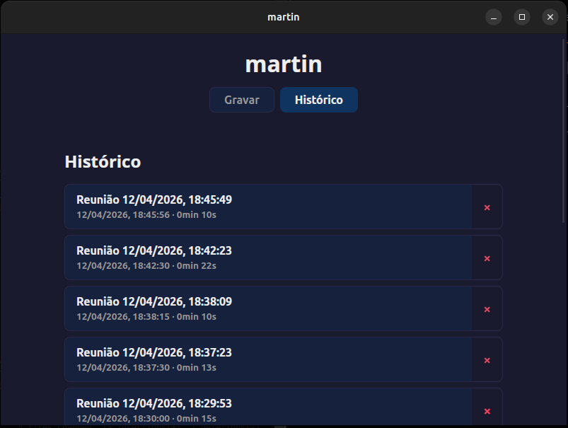
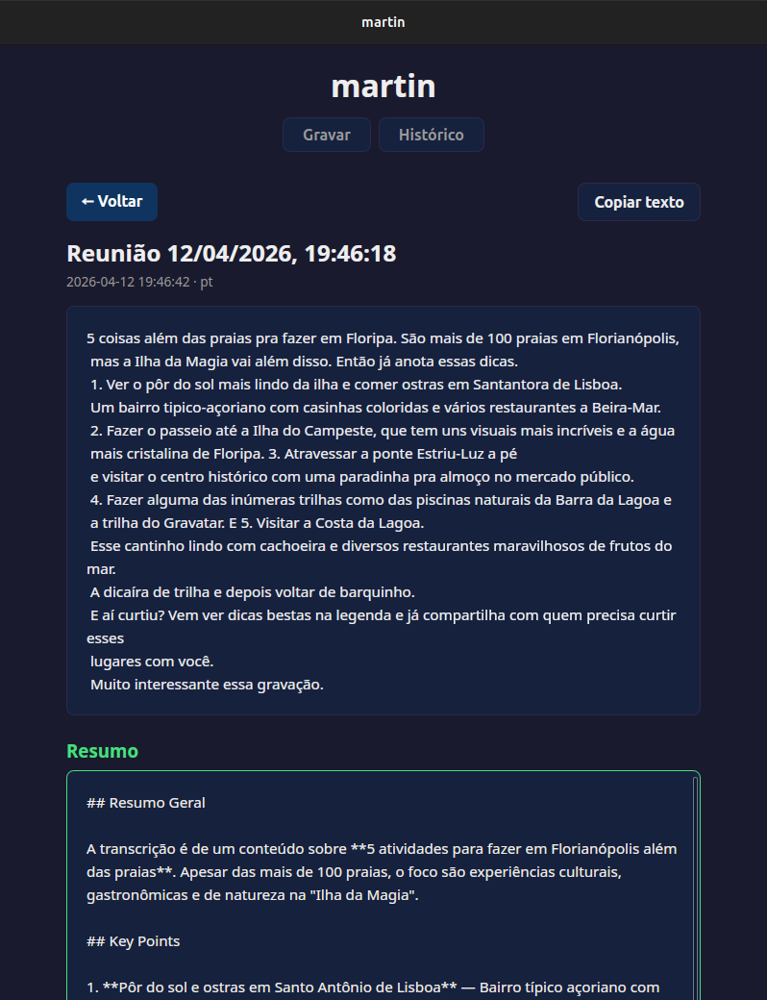

# martin

Privacy-first meeting transcriber and dictation tool for Linux. Records microphone and system audio, transcribes locally with Whisper, stores results in SQLite. No cloud, no internet — your audio never leaves your machine.

Two modes: **Record** meetings with dual audio capture (mic + system), or **Dictate** with real-time speech-to-text that shows words as you speak.

## Screenshots

| Recorder | Recording in progress |
|----------|-----------------------|
|  |  |

| Pending recordings | Finalizing transcription |
|--------------------|--------------------------|
|  |  |

| History | Summary |
|---------|---------|
|  |  |

## Features

### Recording mode
- **Dual audio capture** — records microphone + system audio (browser, Zoom, Meet) via PipeWire
- **Pending recordings** — recordings are tracked in the database, survive app restarts, and can be transcribed or deleted from a list
- **Non-blocking stop** — stopping long recordings runs mixing in the background, UI stays responsive

### Dictation mode
- **Real-time transcription** — speaks and sees text appear live as you talk
- **Mic-only capture** — uses microphone directly, no system audio needed
- **Three-state indicator** — Listening / Processing / Paused, so you know what the app is doing
- **VU meter** — visual confirmation that the microphone is picking up your voice
- **Provisional vs stable text** — recently transcribed text shown in gray italic (may still be refined), confirmed text in normal style
- **Automatic paragraphs** — long pauses (>2.5s) become paragraph breaks in the output
- **Voice formatting commands** — say "novo parágrafo", "nova linha", "ponto final", "vírgula", "ponto de interrogação", "ponto de exclamação", "abre aspas", "fecha aspas" to insert formatting
- **Smart capitalization** — sentences are capitalized automatically and punctuation spacing is normalized
- **Silence-aware** — skips whisper passes during silence to save CPU
- **Continuous auto-save** — partial transcript is persisted every 5 seconds; nothing is lost if the app crashes
- **Audio preserved** — raw mic audio is saved as a WAV alongside the transcript so you can reprocess later if needed

### General
- **Auto-download model** — Whisper model downloads automatically on first use, with progress bar
- **Local transcription** — Whisper runs on your machine, no internet needed
- **Bilingual UI** — Portuguese and English, follows system locale (also used for transcription language)
- **Transcription history** — browse, view, copy, and delete past transcriptions
- **AI summary** — summarize transcriptions with key points via Claude Code CLI, with copy support
- **Privacy first** — audio files deleted after transcription, data stays in local SQLite

## Requirements

- Linux with PipeWire (Ubuntu 22.10+, Fedora 36+, etc.)
- `pw-record` and `wpctl` (included with PipeWire)
- Rust 1.70+
- Node.js 18+

### System dependencies

```bash
# Ubuntu/Debian
sudo apt install -y libwebkit2gtk-4.1-dev libgtk-3-dev libasound2-dev libpulse-dev \
  build-essential libssl-dev libayatana-appindicator3-dev librsvg2-dev pipewire
```

## Install

### From .deb (recommended)

Download the latest `.deb` from [GitHub Releases](https://github.com/vagnerzampieri/martin/releases) and install:

```bash
sudo apt install ./martin_0.1.0_amd64.deb
```

On first use, the app automatically downloads the Whisper model (~466MB). Internet required only for this one-time download.

### From source

```bash
git clone https://github.com/vagnerzampieri/martin.git
cd martin
npm install
cargo install tauri-cli --version "^2"
cargo tauri build
```

The binary will be in `src-tauri/target/release/martin`.

## Usage

### Recording a meeting

1. Open martin and select the **Record** tab
2. Click **Start Recording** / **Iniciar Gravação**
3. Have your meeting — both your mic and system audio are captured
4. Click **Stop Recording** / **Parar Gravação** — recording appears in the pending list
5. Click **Transcribe** / **Transcrever** on the pending item — wait for local transcription
6. Done. Text is saved, audio is deleted.

You can record multiple times before transcribing — each recording is tracked separately. Close and reopen the app; your pending recordings are still there.

### Dictating text

1. Select the **Dictation** / **Ditado** tab
2. Click **Start Dictation** / **Iniciar Ditado**
3. Speak — text appears in real time as you talk
4. Click **Stop Dictation** / **Parar Ditado** — the full text is saved to history

### Voice commands (Portuguese)

Speak these phrases mid-dictation to insert punctuation or formatting.
Matching is **case-insensitive** and **accent-insensitive** — `novo paragrafo`
works the same as `novo parágrafo`, and Whisper dropping a diacritic
does not break the command.

| Say (PT)                                   | Produces  |
|--------------------------------------------|-----------|
| `novo parágrafo` *or* `ponto parágrafo`    | new paragraph (`\n\n`) |
| `nova linha`                               | newline (`\n`) |
| `ponto final`                              | `.`       |
| `vírgula`                                  | `,`       |
| `ponto de interrogação`                    | `?`       |
| `ponto de exclamação`                      | `!`       |
| `abre aspas`                               | `"` (opening) |
| `fecha aspas`                              | `"` (closing) |

The dictation also reacts to silence:

- A pause of **~2 seconds** flips the UI state to **Pausa detectada**
  (no other effect — speak again and it resumes)
- A pause of **~5 seconds** commits the current text and starts a new
  paragraph automatically — useful when you stop to think between thoughts

## How audio capture works

### Recording mode

Records two audio sources simultaneously:

- **Microphone** — captured via cpal (ALSA backend)
- **System audio** — captured via `pw-record` targeting the default PipeWire sink

When you stop recording, both WAV files are mixed into a single file. If PipeWire is not available or the system audio is corrupt, martin falls back to microphone-only recording. The mixed file is saved as a pending recording and can be transcribed later.

### Dictation mode

Captures microphone audio via cpal and transcribes in real time:

- Audio streams into a shared buffer at the device's native sample rate
- A second thread emits the audio level (`dictation://level`) and session state (`dictation://state`, one of `listening`/`processing`/`paused`) for UI feedback
- Every ~500ms, the transcription loop drains new samples, measures RMS, and skips the whisper pass if the chunk is silent
- When there is enough new audio, the full accumulated buffer is converted to mono 16kHz and sent to Whisper for re-transcription (this is what keeps the output accurate — Whisper self-corrects with more context)
- The output passes through a text-normalization pipeline (voice command substitution → punctuation spacing → whitespace collapse → sentence capitalization) before being emitted
- A pause longer than ~2.5s commits the current text as a segment and inserts a paragraph break (`\n\n`) before the next segment
- When the buffer exceeds 120 seconds, the current segment is committed (reusing the last transcription) and a new buffer starts
- The mic audio is written to a WAV file in real time, so the audio is available for reprocessing after the session ends
- The partial transcription row is created on `Start Dictation` and updated every ~5s during the session; on `Stop Dictation` the same row is finalized

## Whisper Models

| Model | Size | Quality | Speed |
|-------|------|---------|-------|
| tiny | 75MB | Usable | Fast |
| base | 142MB | Good | Fast |
| small | 466MB | Very good | Moderate |
| medium | 1.5GB | Excellent | Slow |

Download with: `./scripts/download-model.sh <model>`

## Development

```bash
cargo tauri dev          # Full app dev mode with hot reload
cargo test               # Run Rust tests
npm run check            # Svelte/TypeScript type checking
cargo fmt                # Format Rust code
cargo clippy             # Lint Rust code
```

## Architecture

```
src-tauri/src/
├── lib.rs              # Tauri commands, app state
├── audio/
│   ├── capture.rs      # Mic (cpal) + system audio (pw-record)
│   ├── mix.rs          # WAV mixing (mic + system → single file)
│   └── wav_writer.rs   # Thread-safe WAV writer (used by recorder and dictation)
├── db/
│   └── store.rs        # SQLite CRUD for transcriptions + pending recordings
├── dictation.rs        # Real-time mic capture + transcription loop + level/state emitter
├── model.rs            # Auto-download Whisper model with progress events
├── postprocess.rs      # Pure text normalization: voice commands, spacing, capitalization
├── summarize.rs        # Claude CLI integration for AI summaries
├── vad.rs              # Pure RMS-based silence detection helpers
└── transcribe/
    ├── whisper.rs      # Whisper transcription + WAV loading + resampling
    └── job.rs          # Finalize worker + cancel/progress orchestration

src/
├── lib/
│   ├── i18n.js         # Locale detection + translations (pt/en)
│   ├── format.js       # Shared date/duration formatting
│   ├── appBusy.js      # Cross-tab "app busy" store
│   ├── Recorder.svelte # Recording controls + pending recordings list
│   ├── Dictation.svelte # Real-time dictation with state/level/provisional UI
│   ├── VuMeter.svelte  # Audio-level meter component
│   ├── FinalizingProgress.svelte # Progress overlay for finalize phase
│   ├── ModelDownload.svelte # Model download progress overlay
│   ├── History.svelte  # Transcription list
│   └── TranscriptionView.svelte  # View + copy + summarize
└── routes/
    └── +page.svelte    # Main page (three tabs: Record / Dictation / History)
```

## License

GPLv3
